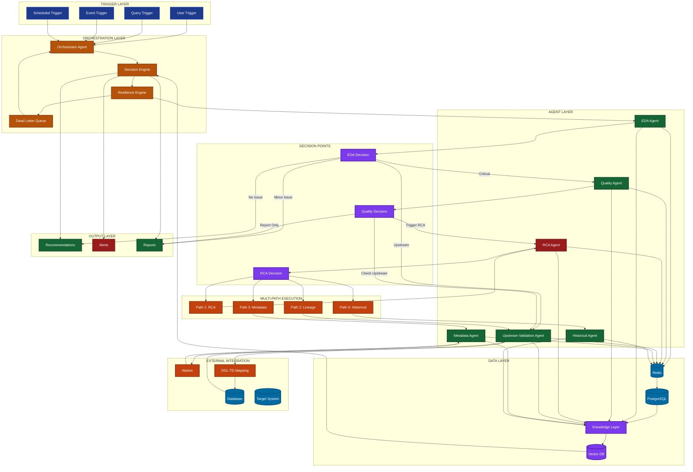

# Agentic Data Intelligence System - Detailed Architecture Diagram

## Agentic Decision Flow

```mermaid
graph TB
    subgraph "TRIGGER LAYER"
        UI[User Trigger]
        QT[Query Trigger]
        ET[Event Trigger]
        ST[Scheduled Trigger]
    end
    
    subgraph "ORCHESTRATION LAYER"
        ORCH[Orchestrator Agent]
        DEC[Decision Engine]
        RES[Resilience Engine]
        DLQ[Dead Letter Queue]
    end
    
    subgraph "AGENT LAYER"
        EDA[EDA Agent]
        DQ[Quality Agent]
        RCA[RCA Agent]
        UP[Upstream Validation Agent]
        META[Metadata Agent]
        HIST[Historical Agent]
    end
    
    subgraph "DECISION POINTS"
        DP1[EDA Decision]
        DP2[Quality Decision]
        DP3[RCA Decision]
    end
    
    subgraph "MULTI-PATH EXECUTION"
        P1[Path 1: RCA]
        P2[Path 2: Lineage]
        P3[Path 3: Metadata]
        P4[Path 4: Historical]
    end
    
    subgraph "DATA LAYER"
        REDIS[(Redis)]
        PG[(PostgreSQL)]
        KNOW[Knowledge Layer]
        VDB[(Vector DB)]
    end
    
    subgraph "EXTERNAL INTEGRATION"
        ALATION[Alation]
        DDL[DDL-TD Mapping]
        DB[(Database)]
        TARGET[(Target System)]
    end
    
    subgraph "OUTPUT LAYER"
        REC[Recommendations]
        ALERT[Alerts]
        REPORT[Reports]
    end
    
    UI --> ORCH
    QT --> ORCH
    ET --> ORCH
    ST --> ORCH
    
    ORCH --> DEC
    DEC --> RES
    RES --> EDA
    RES --> DLQ
    DLQ --> ORCH
    
    EDA --> DP1
    DP1 -->|No Issue| REC
    DP1 -->|Minor Issue| REPORT
    DP1 -->|Critical| DQ
    DP1 -->|Upstream| UP
    
    DQ --> DP2
    DP2 -->|Report Only| REPORT
    DP2 -->|Trigger RCA| RCA
    DP2 -->|Check Upstream| UP
    
    RCA --> DP3
    DP3 --> P1
    DP3 --> P2
    DP3 --> P3
    DP3 --> P4
    
    P1 --> RCA
    P2 --> UP
    P3 --> META
    P4 --> HIST
    
    UP --> DDL
    DDL --> DB
    DB --> UP
    
    META --> ALATION
    ALATION --> META
    
    EDA --> REDIS
    DQ --> REDIS
    RCA --> REDIS
    UP --> REDIS
    META --> REDIS
    HIST --> REDIS
    
    REDIS --> PG
    PG --> KNOW
    KNOW --> VDB
    VDB --> DEC
    
    EDA --> KNOW
    DQ --> KNOW
    RCA --> KNOW
    UP --> KNOW
    META --> KNOW
    HIST --> KNOW
    
    DEC --> REC
    DEC --> ALERT
    DEC --> REPORT
    
    style UI fill:#1e3a8a,stroke:#1e40af,stroke-width:3px,color:#ffffff
    style QT fill:#1e3a8a,stroke:#1e40af,stroke-width:3px,color:#ffffff
    style ET fill:#1e3a8a,stroke:#1e40af,stroke-width:3px,color:#ffffff
    style ST fill:#1e3a8a,stroke:#1e40af,stroke-width:3px,color:#ffffff
    style ORCH fill:#b45309,stroke:#92400e,stroke-width:3px,color:#ffffff
    style DEC fill:#b45309,stroke:#92400e,stroke-width:3px,color:#ffffff
    style RES fill:#b45309,stroke:#92400e,stroke-width:3px,color:#ffffff
    style DLQ fill:#b45309,stroke:#92400e,stroke-width:3px,color:#ffffff
    style EDA fill:#166534,stroke:#14532d,stroke-width:3px,color:#ffffff
    style DQ fill:#166534,stroke:#14532d,stroke-width:3px,color:#ffffff
    style RCA fill:#991b1b,stroke:#7f1d1d,stroke-width:3px,color:#ffffff
    style UP fill:#166534,stroke:#14532d,stroke-width:3px,color:#ffffff
    style META fill:#166534,stroke:#14532d,stroke-width:3px,color:#ffffff
    style HIST fill:#166534,stroke:#14532d,stroke-width:3px,color:#ffffff
    style DP1 fill:#7c3aed,stroke:#5b21b6,stroke-width:3px,color:#ffffff
    style DP2 fill:#7c3aed,stroke:#5b21b6,stroke-width:3px,color:#ffffff
    style DP3 fill:#7c3aed,stroke:#5b21b6,stroke-width:3px,color:#ffffff
    style P1 fill:#c2410c,stroke:#9a3412,stroke-width:3px,color:#ffffff
    style P2 fill:#c2410c,stroke:#9a3412,stroke-width:3px,color:#ffffff
    style P3 fill:#c2410c,stroke:#9a3412,stroke-width:3px,color:#ffffff
    style P4 fill:#c2410c,stroke:#9a3412,stroke-width:3px,color:#ffffff
    style REDIS fill:#0369a1,stroke:#075985,stroke-width:3px,color:#ffffff
    style PG fill:#0369a1,stroke:#075985,stroke-width:3px,color:#ffffff
    style KNOW fill:#7c3aed,stroke:#5b21b6,stroke-width:3px,color:#ffffff
    style VDB fill:#7c3aed,stroke:#5b21b6,stroke-width:3px,color:#ffffff
    style ALATION fill:#c2410c,stroke:#9a3412,stroke-width:3px,color:#ffffff
    style DDL fill:#c2410c,stroke:#9a3412,stroke-width:3px,color:#ffffff
    style DB fill:#0369a1,stroke:#075985,stroke-width:3px,color:#ffffff
    style TARGET fill:#0369a1,stroke:#075985,stroke-width:3px,color:#ffffff
    style REC fill:#166534,stroke:#14532d,stroke-width:3px,color:#ffffff
    style ALERT fill:#991b1b,stroke:#7f1d1d,stroke-width:3px,color:#ffffff
    style REPORT fill:#166534,stroke:#14532d,stroke-width:3px,color:#ffffff
```
