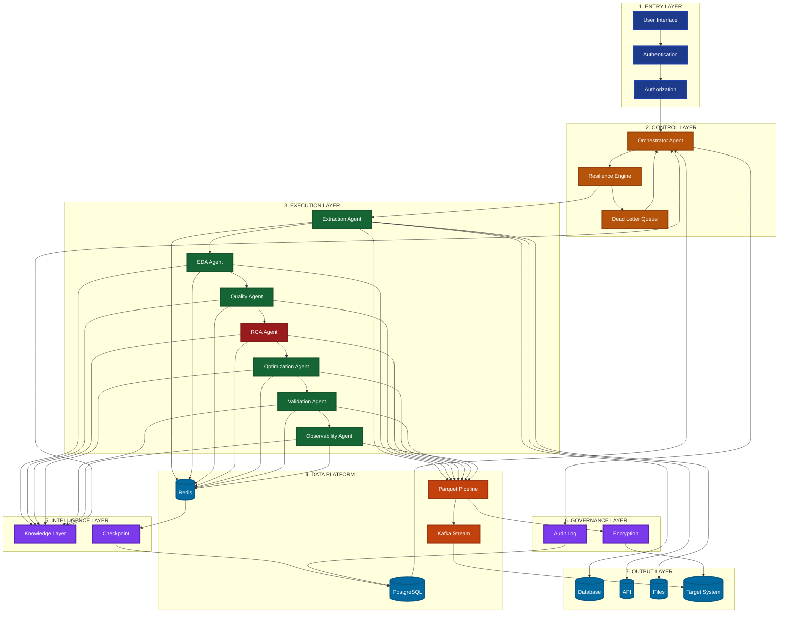

# Agentic DE Lifecycle - Executive Architecture Diagram

## Executive Summary View

## Architecture Narrative

**1. Entry Layer** - User access with authentication and authorization
**2. Control Layer** - Orchestrator manages workflow with resilience engine
**3. Execution Layer** - 7 specialized agents process data sequentially
**4. Data Platform** - Redis, PostgreSQL, Parquet pipeline, Kafka stream
**5. Intelligence Layer** - Knowledge layer learns, checkpoint enables resume
**6. Governance Layer** - Encryption secures data, audit log ensures compliance
**7. Output Layer** - Delivers data to database, API, files, or target system
