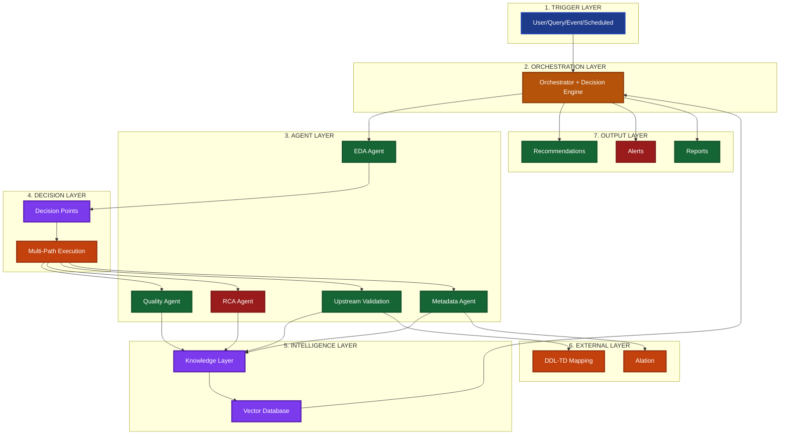

# Agentic Data Intelligence System - Executive Architecture Diagram

## Executive Summary View

## Architecture Narrative

**1. Trigger Layer** - User, query, event, or scheduled triggers initiate analysis
**2. Orchestration Layer** - Orchestrator with decision engine manages agentic workflows
**3. Agent Layer** - Specialized agents (EDA, Quality, RCA, Upstream, Metadata) execute analysis
**4. Decision Layer** - Decision points route to appropriate agents; multi-path execution for complex issues
**5. Intelligence Layer** - Knowledge layer learns patterns; vector database enables contextual decisions
**6. External Layer** - Alation for metadata; DDL-TD mapping for upstream validation
**7. Output Layer** - Recommendations, alerts, and reports guide next steps
