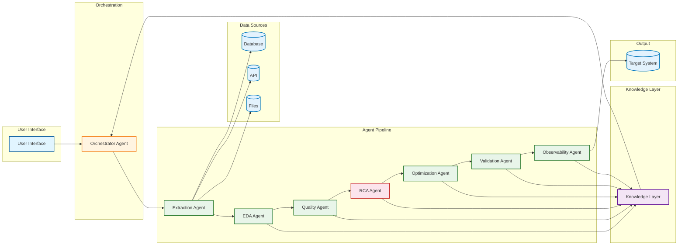

# Agentic DE Lifecycle - Architecture Diagram

## Multi-Agent Agentic Flow

```mermaid
graph LR
    subgraph "User Interface"
        UI[User Interface]
    end
    
    subgraph "Orchestration"
        ORCH[Orchestrator Agent]
    end
    
    subgraph "Data Sources"
        DB[(Database)]
        API[(API)]
        FILES[(Files)]
    end
    
    subgraph "Agent Pipeline"
        INGEST[Extraction Agent]
        EDA[EDA Agent]
        DQ[Quality Agent]
        RCA[RCA Agent]
        OPT[Optimization Agent]
        VAL[Validation Agent]
        OBS[Observability Agent]
    end
    
    subgraph "Knowledge Layer"
        KNOW[Knowledge Layer]
    end
    
    subgraph "Output"
        TARGET[(Target System)]
    end
    
    UI --> ORCH
    ORCH --> INGEST
    INGEST --> DB
    INGEST --> API
    INGEST --> FILES
    
    INGEST --> EDA
    EDA --> DQ
    DQ --> RCA
    RCA --> OPT
    OPT --> VAL
    VAL --> OBS
    OBS --> TARGET
    
    EDA --> KNOW
    DQ --> KNOW
    RCA --> KNOW
    OPT --> KNOW
    VAL --> KNOW
    OBS --> KNOW
    
    KNOW --> ORCH
    
    style UI fill:#e1f5ff,stroke:#01579b,stroke-width:2px
    style ORCH fill:#fff4e1,stroke:#f57f17,stroke-width:2px
    style INGEST fill:#e8f5e9,stroke:#2e7d32,stroke-width:2px
    style EDA fill:#e8f5e9,stroke:#2e7d32,stroke-width:2px
    style DQ fill:#e8f5e9,stroke:#2e7d32,stroke-width:2px
    style RCA fill:#fce4ec,stroke:#c62828,stroke-width:2px
    style OPT fill:#e8f5e9,stroke:#2e7d32,stroke-width:2px
    style VAL fill:#e8f5e9,stroke:#2e7d32,stroke-width:2px
    style OBS fill:#e8f5e9,stroke:#2e7d32,stroke-width:2px
    style KNOW fill:#f3e5f5,stroke:#6a1b9a,stroke-width:2px
    style DB fill:#e3f2fd,stroke:#0277bd,stroke-width:2px
    style API fill:#e3f2fd,stroke:#0277bd,stroke-width:2px
    style FILES fill:#e3f2fd,stroke:#0277bd,stroke-width:2px
    style TARGET fill:#e3f2fd,stroke:#0277bd,stroke-width:2px
```
