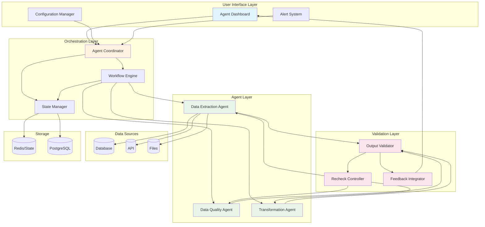
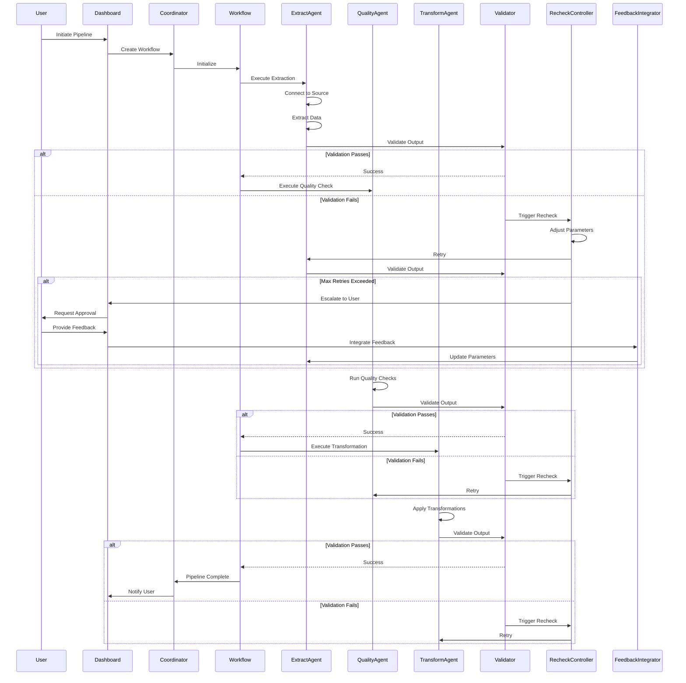
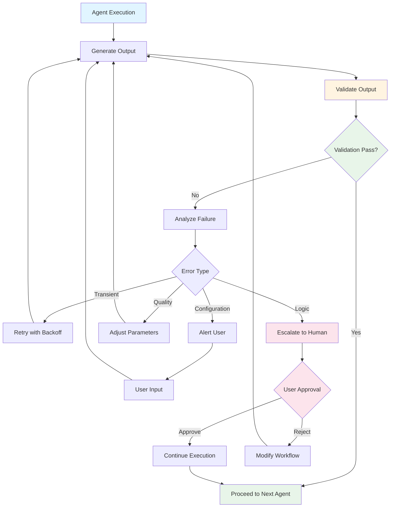
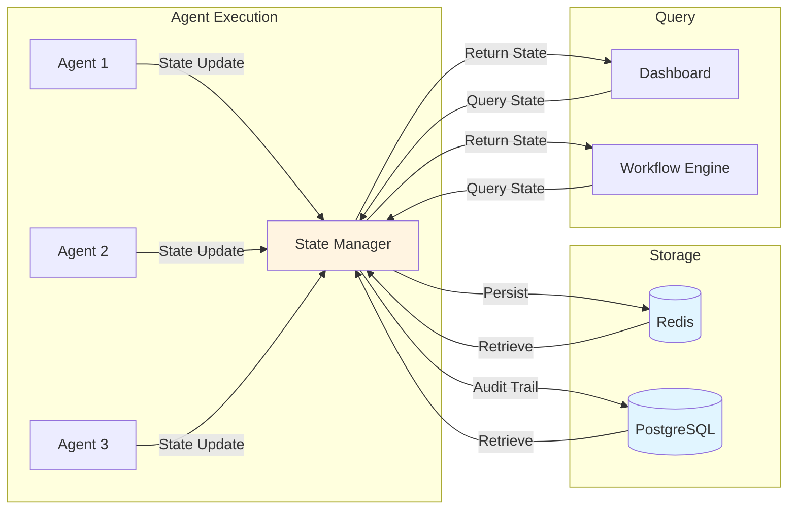
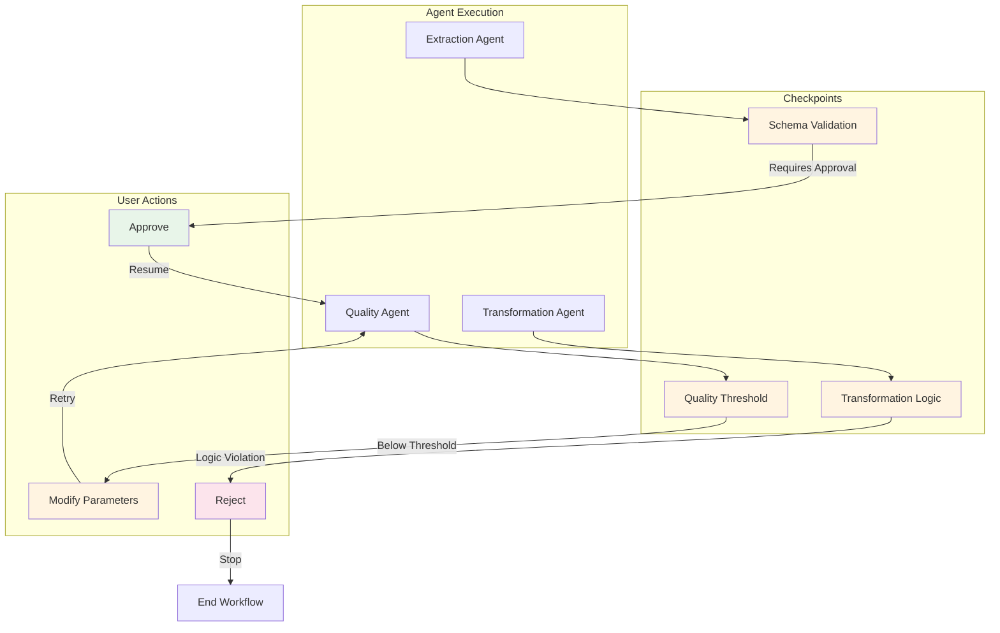
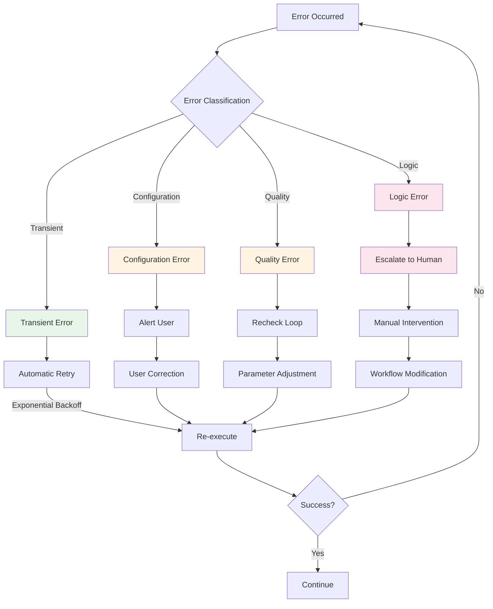
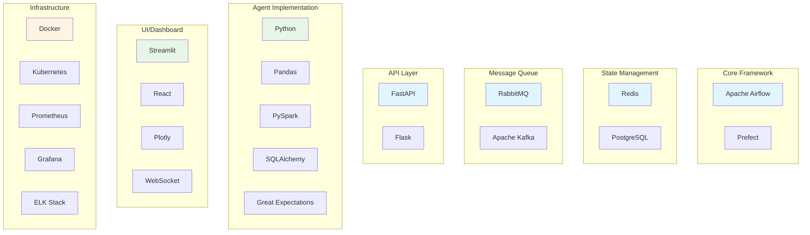

# Agentic DE Lifecycle - Architecture Diagram

## High-Level Architecture

## Detailed Agent Flow with Recheck Loops

## Recheck Loop Logic

## State Management Flow

## Human-in-the-Loop Checkpoints

## Error Handling Strategy

## Technology Stack

