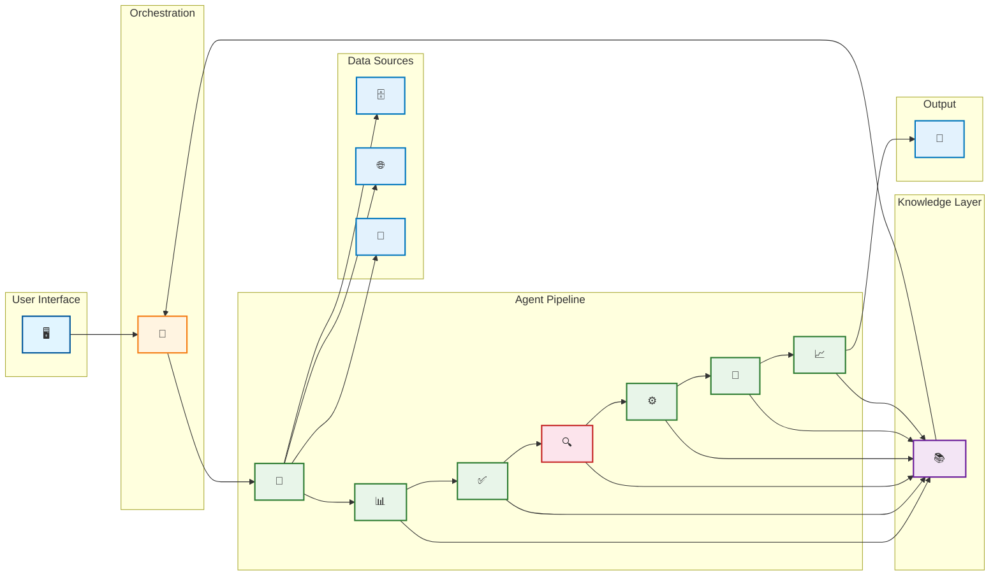

# Agentic DE Lifecycle - Visual Architecture Diagram

## Multi-Agent Agentic Flow with Technology Symbols

## Technology Legend

| Symbol | Component | Technology |
|--------|-----------|------------|
| 🖥️ | User Interface | Streamlit / React |
| 🧠 | Orchestrator | Airflow / Prefect |
| 🔌 | Extraction Agent | SQLAlchemy / psycopg2 |
| 📊 | EDA Agent | Pandas / Plotly |
| ✅ | Quality Agent | Great Expectations / Soda |
| 🔍 | RCA Agent | scikit-learn / TensorFlow |
| ⚙️ | Optimization Agent | dbt / SQLMesh |
| 🎯 | Validation Agent | data-diff / Great Expectations |
| 📈 | Observability Agent | Prometheus / Grafana |
| 📚 | Knowledge Layer | Pinecone / pgvector |
| 🗄️ | Database | PostgreSQL / Oracle |
| 🌐 | API | REST / GraphQL |
| 📁 | Files | Excel / CSV / JSON |
