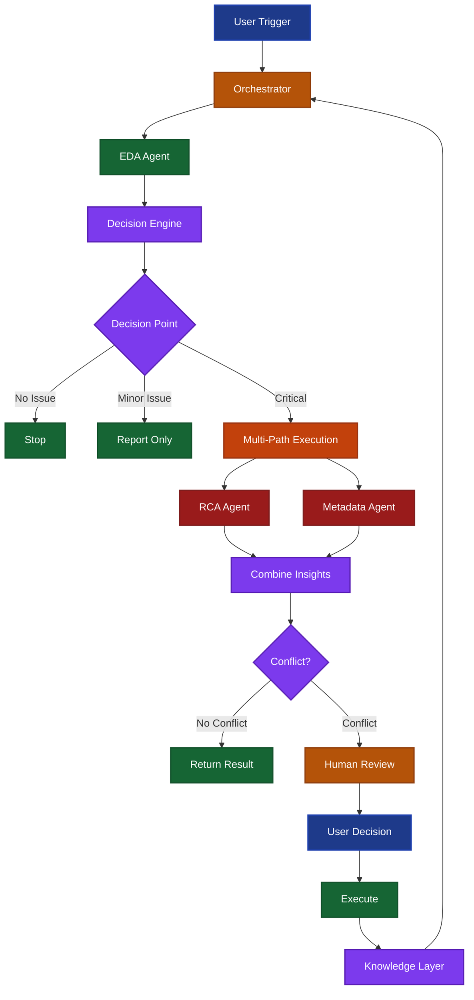

# Before vs After: Rule-Based Tool → Agentic System

## BEFORE: Current Rule-Based Tool (Phase 1)


**Characteristics:**
- Sequential flow (1→2→3→4→5)
- Rule-based thresholds only
- No decision-making
- No routing
- No learning
- User must interpret and act on findings

---

## AFTER: Planned Agentic System (Phase 2)



**Characteristics:**
- Decision-driven flow (multiple paths)
- Hybrid rule-based + LLM decisions
- Autonomous routing based on context
- Multi-path execution for ambiguity
- Conflict detection and resolution
- Human-in-the-loop for trust
- Knowledge layer for learning
- Stop conditions prevent infinite loops

---

## Key Differences

| Aspect | Before (Rule-Based) | After (Agentic) |
|--------|---------------------|-----------------|
| **Flow** | Sequential (1→2→3) | Decision-driven (multiple paths) |
| **Decision Making** | None (rules only) | Hybrid (rules + LLM) with confidence |
| **Routing** | Fixed sequence | Dynamic based on context |
| **Ambiguity Handling** | User must interpret | System routes to appropriate paths |
| **Learning** | None | Knowledge layer stores patterns |
| **Trust** | User must verify everything | Human-in-the-loop for critical decisions |
| **Scope** | EDA + quality checks | EDA + quality + RCA + metadata + routing |
| **Output** | Static report | Contextual recommendations with actions |

---

## Progress Summary

### Phase 1 (Built ✅)
- Rule-based EDA Agent
- Basic quality checks
- Streamlit UI
- Database + File upload modes

### Phase 2 (Designed, Not Built)
- Decision Engine (hybrid rules + LLM)
- RCA Agent (minimal)
- Metadata Agent (Alation integration)
- Self-Routing Logic
- Human-in-the-Loop UI
- Knowledge Layer (pattern storage)
- Stop Conditions
- Conflict Handling

### Phase 3 (Designed, Not Built)
- Upstream Validation Agent
- Full Multi-Path Execution
- DDL-TD Table Relationship Mapping
- Advanced Learning System

---

## What Makes This Agentic

**Before:** Pipeline executes predetermined steps
**After:** System makes decisions at key points:

```
EDA Output → Decision Engine →
   if high_null + critical_column → RCA
   if high_null + known_pattern → Ignore
   if duplicates → PK validation
   if freshness_delay → Ingestion check
   if conflict → Human review
```

**The system chooses from multiple options based on context, not just follows a sequence.**
