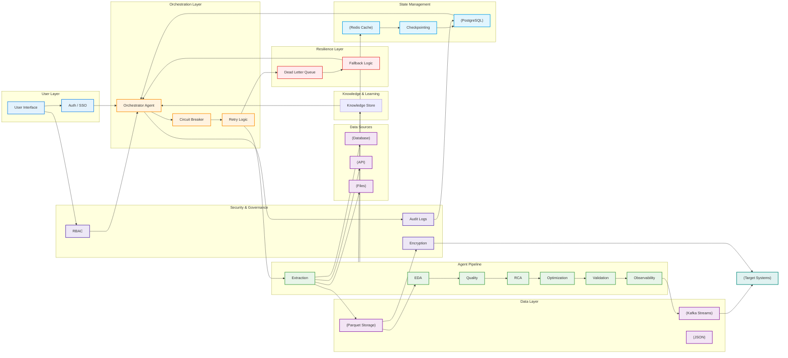

```mermaid
flowchart LR
    %% =========================
    %% UI Layer
    %% =========================
    subgraph UI[User Layer]
        UI_APP[User Interface]
        AUTH[Auth / SSO]
    end

    %% =========================
    %% Orchestration Layer
    %% =========================
    subgraph ORCH[Orchestration Layer]
        ORCHESTRATOR[Orchestrator Agent]
        CB[Circuit Breaker]
        RETRY[Retry Logic]
    end

    %% =========================
    %% Data Sources
    %% =========================
    subgraph SRC[Data Sources]
        DB["(Database)"]
        API["(API)"]
        FILES["(Files)"]
    end

    %% =========================
    %% Agent Pipeline
    %% =========================
    subgraph AGENTS[Agent Pipeline]
        INGEST[Extraction]
        EDA[EDA]
        DQ[Quality]
        RCA[RCA]
        OPT[Optimization]
        VAL[Validation]
        OBS[Observability]
    end

    %% =========================
    %% Data Layer
    %% =========================
    subgraph DATA[Data Layer]
        PARQUET["(Parquet Storage)"]
        KAFKA["(Kafka Streams)"]
        JSON["(JSON)"]
    end

    %% =========================
    %% State Management
    %% =========================
    subgraph STATE[State Management]
        REDIS["(Redis Cache)"]
        CHECK[Checkpointing]
        PG["(PostgreSQL)"]
    end

    %% =========================
    %% Knowledge Layer
    %% =========================
    subgraph KNOWLEDGE[Knowledge & Learning]
        KNOW[Knowledge Store]
    end

    %% =========================
    %% Error Handling
    %% =========================
    subgraph ERROR[Resilience Layer]
        DLQ[Dead Letter Queue]
        FALLBACK[Fallback Logic]
    end

    %% =========================
    %% Security (Cross-Cutting)
    %% =========================
    subgraph SECURITY[Security & Governance]
        ENC[Encryption]
        RBAC[RBAC]
        AUDIT[Audit Logs]
    end

    %% =========================
    %% Output
    %% =========================
    TARGET["(Target Systems)"]
    %% FLOW
    %% =========================

    %% UI -> Orchestration
    UI_APP --> AUTH --> ORCHESTRATOR

    %% Resilience
    ORCHESTRATOR --> CB --> RETRY
    RETRY --> INGEST
    RETRY --> DLQ --> FALLBACK --> ORCHESTRATOR

    %% Source ingestion
    INGEST --> DB
    INGEST --> API
    INGEST --> FILES

    %% Agent flow (simplified linear pipeline)
    INGEST --> PARQUET
    PARQUET --> EDA --> DQ --> RCA --> OPT --> VAL --> OBS

    %% Output flow
    OBS --> KAFKA --> TARGET

    %% State persistence
    AGENTS --> REDIS
    REDIS --> CHECK --> PG
    PG --> ORCHESTRATOR

    %% Knowledge feedback loop
    AGENTS --> KNOW
    KNOW --> ORCHESTRATOR

    %% Security overlays
    UI_APP --> RBAC --> ORCHESTRATOR
    PARQUET --> ENC --> TARGET
    ORCHESTRATOR --> AUDIT --> PG

    %% =========================
    %% STYLING
    %% =========================

    classDef ui fill:#e3f2fd,stroke:#1e88e5,stroke-width:2px;
    classDef orchestration fill:#fff3e0,stroke:#fb8c00,stroke-width:2px;
    classDef agents fill:#e8f5e9,stroke:#43a047,stroke-width:2px;
    classDef data fill:#f3e5f5,stroke:#8e24aa,stroke-width:2px;
    classDef state fill:#e1f5fe,stroke:#039be5,stroke-width:2px;
    classDef error fill:#ffebee,stroke:#e53935,stroke-width:2px;
    classDef security fill:#ede7f6,stroke:#5e35b1,stroke-width:2px;
    classDef output fill:#e0f2f1,stroke:#00897b,stroke-width:2px;

    class UI_APP,AUTH ui
    class ORCHESTRATOR,CB,RETRY orchestration
    class INGEST,EDA,DQ,RCA,OPT,VAL,OBS agents
    class PARQUET,JSON,KAFKA,DB,API,FILES data
    class REDIS,CHECK,PG state
    class DLQ,FALLBACK error
    class ENC,RBAC,AUDIT security
    class TARGET output
```
