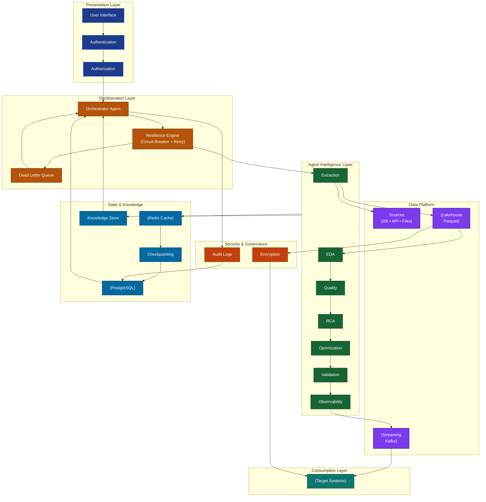

```mermaid
flowchart TB

%% =========================
%% PRESENTATION
%% =========================
subgraph L1["Presentation Layer"]
    UI[User Interface]
    AUTH[Authentication]
    RBAC[Authorization]
end

%% =========================
%% ORCHESTRATION
%% =========================
subgraph L2["Orchestration Layer"]
    ORCH[Orchestrator Agent]
    RESILIENCE["Resilience Engine<br/>(Circuit Breaker + Retry)"]
    DLQ[Dead Letter Queue]
end

%% =========================
%% AGENT FABRIC
%% =========================
subgraph L3["Agent Intelligence Layer"]
    INGEST[Extraction]
    EDA[EDA]
    DQ[Quality]
    RCA[RCA]
    OPT[Optimization]
    VAL[Validation]
    OBS[Observability]
end

%% =========================
%% DATA PLATFORM
%% =========================
subgraph L4["Data Platform"]
    SOURCES["Sources<br/>(DB • API • Files)"]
    STORAGE["(Lakehouse<br/>Parquet)"]
    STREAM["(Streaming<br/>Kafka)"]
end

%% =========================
%% STATE & KNOWLEDGE
%% =========================
subgraph L5["State & Knowledge"]
    CACHE["(Redis Cache)"]
    META["(PostgreSQL)"]
    CHECK[Checkpointing]
    KNOW[Knowledge Store]
end

%% =========================
%% GOVERNANCE
%% =========================
subgraph L6["Security & Governance"]
    ENC[Encryption]
    AUDIT[Audit Logs]
end

%% =========================
%% OUTPUT
%% =========================
subgraph L7["Consumption Layer"]
    TARGET["(Target Systems)"]
end

%% =========================
%% FLOW
%% =========================

%% Entry
UI --> AUTH --> RBAC --> ORCH

%% Resilience
ORCH --> RESILIENCE --> INGEST
RESILIENCE --> DLQ --> ORCH

%% Sources
INGEST --> SOURCES

%% Core pipeline (clean linear)
INGEST --> STORAGE --> EDA --> DQ --> RCA --> OPT --> VAL --> OBS

%% Output
OBS --> STREAM --> TARGET

%% State management (side channel)
L3 --> CACHE --> CHECK --> META
META --> ORCH

%% Knowledge loop
L3 --> KNOW --> ORCH

%% Governance
STORAGE --> ENC --> TARGET
ORCH --> AUDIT --> META

%% =========================
%% STYLING (EXECUTIVE CLEAN)
%% =========================
classDef presentation fill:#1e3a8a,color:#ffffff,stroke:#1e40af,stroke-width:2px
classDef orchestration fill:#b45309,color:#ffffff,stroke:#92400e,stroke-width:2px
classDef agents fill:#166534,color:#ffffff,stroke:#14532d,stroke-width:2px
classDef data fill:#7c3aed,color:#ffffff,stroke:#5b21b6,stroke-width:2px
classDef state fill:#0369a1,color:#ffffff,stroke:#075985,stroke-width:2px
classDef gov fill:#c2410c,color:#ffffff,stroke:#9a3412,stroke-width:2px
classDef output fill:#0f766e,color:#ffffff,stroke:#115e59,stroke-width:2px

class UI,AUTH,RBAC presentation
class ORCH,RESILIENCE,DLQ orchestration
class INGEST,EDA,DQ,RCA,OPT,VAL,OBS agents
class SOURCES,STORAGE,STREAM data
class CACHE,META,CHECK,KNOW state
class ENC,AUDIT gov
class TARGET output
```
